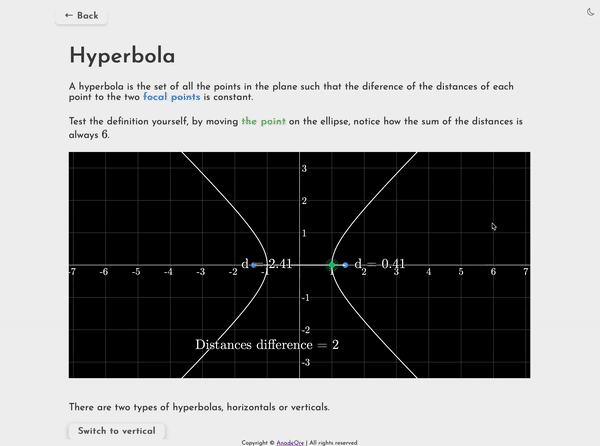

# AniMaths

   

- Redux was used to change languages: English and Spanish.

### Live version [here](https://animaths.vercel.app)

### Animations are made with [Mafs](https://mafs.dev)

#### Light mode:

#### Dark mode:

### Time to learn!

